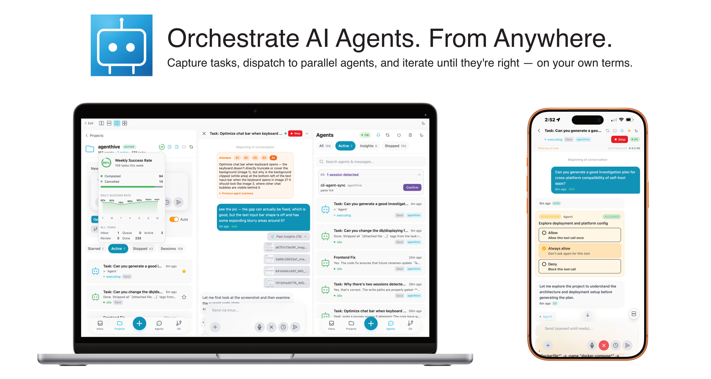

# AgentHive

[](LICENSE)
[](https://www.python.org/downloads/)
[](https://react.dev)
[](https://fastapi.tiangolo.com)

> [**Getting Started**](#getting-started) · [**The Loop**](#the-loop) · [**Features**](#features) · [**Roadmap**](#roadmap) · [**Contributing**](CONTRIBUTING.md)

<p align="center">
  
</p>


**All your AI worker bees in one hive. 🐝**

AgentHive is a web-based control layer for [Claude Code](https://docs.anthropic.com/en/docs/claude-code) that turns it from a synchronous terminal tool into an asynchronous, agentic workflow. Capture ideas from your phone or by voice, dispatch to parallel agents on isolated worktrees, monitor progress in real time, and iterate with auto-summarized context when agents miss the mark. Your existing CLAUDE.md files, project setup, and CLI sessions all carry over, and project knowledge grows with every session.

If you find AgentHive useful, a star helps others discover it :)

## The Loop

Traditional task management tracks what **you** need to do. AgentHive tracks what your **agents** are doing.

### 1. Capture

Get ideas out of your head and into the system — fast, from anywhere.

- **Inbox** — a persistent queue for tasks across all your projects. Tasks wait here until you're ready to dispatch them.
- **Voice input** — dictate tasks using speech-to-text. Great for quick ideas on your phone while walking the dog.
- **Lightning input** — rapid task creation with minimal friction. Title, project, go.
- **Draft persistence** — edits are cached locally as you type. Close the app, lose connection, or switch tasks — your unsaved work is still there when you come back.

### 2. Dispatch

Assign tasks to AI agents and let them work.

- **Task → Agent** — turn any task into an autonomous agent with one click. Pick a model (Opus/Sonnet/Haiku), set permissions, and let the agent do the work while you move on.
- **Parallel execution** — run 5, 10, or more agents in parallel across different projects. Each agent gets its own isolated git worktree so they never step on each other's code.
- **AI batch processing** — got a pile of tasks in your inbox? One click to let AI triage and dispatch them in bulk, instead of handling each one manually.
- **RAG-powered context** — when dispatching a task, AgentHive automatically retrieves relevant history from past agent sessions. Your new agent starts with the lessons learned, not from scratch.
- **Cross-session reference** — tell an agent "check ah session `<session_id>`" and it can read another agent's full conversation via a built-in [MCP server](orchestrator/mcp_server.py).

### 3. Monitor

Watch everything happen in real time — from your desk or your phone.

- **Mobile-first web UI** — a full PWA you can add to your Home Screen. Works on any device, any screen size.
- **Split screen** — monitor 2, 3, or 4 agents side by side (2-column, 3-column, 2x2 grid on desktop; stacked on mobile). Each pane navigates independently.
- **Rich chat interface** — markdown rendering, inline image and media preview, interactive cards for tool approvals and plan review. Approve, deny, or respond to agents directly in the conversation.
- **Dual-directional CLI sync** — CLI sessions appear in the web app, web app sessions are resumable from the CLI. Attach to any agent's terminal with `tmux attach -t ah-<agent-id prefix>` and keep working from your keyboard. One conversation history, two interfaces.

  
- **Smart notifications** — Web Push and Telegram with dual-channel in-use detection: if you're viewing an agent in the browser (WebSocket presence) or attached to its tmux pane, notifications are suppressed. Permission requests always cut through.
- **System & usage monitoring** — disk, memory, GPU status, and token usage at a glance.

### 4. Review

Check results, give feedback, and keep the knowledge growing.

- **Mark done** — review agent output, approve the work, mark the task complete.
- **Try → Summarize → Retry** — agent didn't nail it? Stop the agent, add your feedback, and AgentHive auto-generates a summary of what was tried. Re-dispatch with full context — the next agent picks up where the last one left off. Iterate until it's right.
- **Git operations** — view diffs, commit history, and branch status per project. One-click cleanup and push when you're satisfied.
- **Growing intelligence** — each project carries a PROGRESS.md where lessons accumulate across sessions. You control which agent conversations generate summaries, review and cherry-pick which insights to keep, and relevant lessons are automatically retrieved (top-k) when dispatching new agents — more control over project memory than Claude Code's native auto-memory.

### 5. Maintain

Your conversations with agents are valuable. Don't lose them.

- **Automatic backups** — database, session history, and project configs are backed up on a configurable schedule. Crash recovery salvages partial output.
- **Session archive** — every agent conversation is persisted and searchable. Star important sessions for quick access. Browse history across projects.
- **Resume anytime** — pick up any agent conversation right where it left off, whether it finished yesterday or last month.
- **Full-text search** — find any task, message, or agent session across your entire history.
- **Progress tracking** — weekly completion stats show how much your agents are getting done. See the trend, not just the backlog.
- **Project memory** — per-project PROGRESS.md managed through the UI. Choose which sessions to summarize, accept or reject individual insights, and edit the file directly. Survives across agents, sessions, and time.

## Why AgentHive?

### Zero Migration Cost

Already using Claude Code? AgentHive plugs right in. It wraps the same `claude` CLI you already know — launched inside tmux sessions on your machine, managed through a web UI. Your existing CLAUDE.md files, project setup, and workflow all carry over. The only new dependencies are **tmux** and optionally **Tailscale** for remote access. No new APIs, no vendor lock-in, no relearning.

### Built for Reliability

AgentHive hooks into Claude Code's native event system — not polling, not heuristics. Notifications, message delivery, and session sync are all event-driven. Messages reach agents through stop-hook dispatch with guaranteed ordering. Session lifecycle is tracked via SessionStart/SessionEnd hooks. Each agent runs in its own tmux session with a dedicated git worktree, with configurable timeouts and automatic crash recovery.

## Features

| Category | What you get |
|---|---|
| **Smart Notifications** | Hook-based notification system with dual-channel in-use detection — automatically notifies when you're away and stays quiet when you're present. Web Push (VAPID) and Telegram. Per-agent mute, global toggles. |
| **Task Management** | Inbox with drag-to-reorder. Voice input. Lightning capture. Draft persistence. Per-project organization. Retry with auto-summarization. |
| **Agent Control** | Start, stop, resume agents. Per-agent model selection (Opus/Sonnet/Haiku). Configurable timeouts and permission modes. AI batch dispatch. RAG-powered context from past sessions. Cross-session reference via MCP — agents can read each other's conversations on demand. |
| **Chat Interface** | Rich markdown rendering (code blocks, tables, images). Inline media preview. Plan mode with approve/reject. Interactive tool confirmation cards. |
| **Monitoring** | Split screen (up to 4 panes). Real-time WebSocket streaming. System monitor (disk, memory, GPU, tokens). Weekly progress stats. |
| **Mobile PWA** | Add to Home Screen on iOS/Android. Full functionality — voice input, push notifications, task management. |
| **CLI Session Sync** | Dual-directional: CLI sessions in the web app, web app sessions resumable from CLI. |
| **Git Integration** | Commit history, diffs, branch status per project. Agents work in isolated worktrees. One-click cleanup and push. |
| **Session History** | Every conversation persisted and searchable. Star sessions. Resume any agent anytime. Full-text search. |
| **Security** | Password auth with exponential-backoff rate limiting. Inactivity lock. HTTPS encryption. |
| **Backups** | Automatic database backups. Session JSONL caching. Crash recovery with partial output salvage. |

## Getting Started

### Prerequisites

- **Linux** or **macOS** host (Ubuntu 22.04+ / macOS 13+ recommended)
- **Node.js** 18+ and npm
- **Python** 3.11+
- **tmux** (usually pre-installed; `sudo apt install tmux` if not)
- **Claude Code CLI** — `npm install -g @anthropic-ai/claude-code`
- **Claude subscription** — Claude Max or Pro (uses your existing subscription, no separate API billing)
- **OpenAI API key** _(optional, for voice input)_

### Quick Start (on host)

```bash
# 1. Clone
git clone https://github.com/jyao97/agenthive.git && cd agenthive

# 2. Run automated setup (installs deps, creates venv, generates SSL certs)
chmod +x setup.sh && ./setup.sh

# 3. Configure
nano .env   # Set HOST_PROJECTS_DIR (required), optionally OPENAI_API_KEY

# 4. Start
./run.sh start
```

Open `https://<machine-ip>:3000` in your browser. Set a password on first visit.

> **Tip:** You can also run `claude` in the project directory and tell it to set up AgentHive for you :)

> **Tip:** Symlink the agenthive repo into `~/ah-projects/` to personalize your experience — let agents improve the tool while you use it.

### First Time on iPhone (on client)

Any device can access AgentHive by simply opening `https://<machine-ip>:3000` in a browser. The steps below are only needed if you want the full PWA app experience on iPhone (home screen icon, fullscreen, push notifications).

1. Open `https://<machine-ip>:3000` in Safari (bypass the certificate warning via **Advanced → Visit Website**, then refresh).
2. Follow the on-screen guide on the login page to install the CA certificate and the AgentHive app.

> **Important:** Install the CA certificate **before** installing the App. The App opens in fullscreen without a browser address bar — if the certificate isn't trusted first, you'll be stuck on a warning page with no way to navigate.

<details>
<summary><strong>Manual setup (without setup.sh)</strong></summary>

**Linux:**
```bash
# Install system deps
sudo apt-get install -y python3 python3-pip python3-venv tmux
npm install -g @anthropic-ai/claude-code
npm install -g pm2
```

**macOS:**
```bash
# Install system deps (requires Homebrew)
brew install python@3.12 tmux
npm install -g @anthropic-ai/claude-code
npm install -g pm2
```

**Then (both platforms):**
```bash
# Set up Python
python3 -m venv .venv
source .venv/bin/activate
pip install -r orchestrator/requirements.txt

# Install frontend deps
cd frontend && npm install && cd ..

# Create required directories
mkdir -p data logs backups project-configs ~/ah-projects

# Configure
cp .env.example .env
nano .env   # Set HOST_PROJECTS_DIR to your ah-projects path

# Copy project registry
cp project-configs/registry.yaml.example project-configs/registry.yaml

# Generate SSL certs — required for:
#   1. Voice input (microphone requires trusted HTTPS)
#   2. PWA home screen icon (iOS fetches icons via a system process that rejects untrusted certs)
#   3. File/image uploads and attachments
mkdir -p certs
# Linux:
LAN_IP=$(hostname -I | awk '{print $1}')
# macOS:
LAN_IP=$(ipconfig getifaddr en0 2>/dev/null || ipconfig getifaddr en1 2>/dev/null || echo 127.0.0.1)

# Option A: mkcert (recommended — enables PWA home screen icons on iOS)
#   brew install mkcert  # or: apt install mkcert
mkcert -install
mkcert -cert-file certs/selfsigned.crt -key-file certs/selfsigned.key \
  localhost 127.0.0.1 ${LAN_IP} agenthive
# Then install the CA root cert on your phone for full trust:
#   macOS:  open "$(mkcert -CAROOT)/rootCA.pem"  → AirDrop to iPhone
#   Or visit https://<ip>:3000 and tap "Install CA certificate" on the login page

# Option B: openssl (basic — browser will show a security warning)
# openssl req -x509 -nodes -days 365 -newkey rsa:2048 \
#   -keyout certs/selfsigned.key -out certs/selfsigned.crt \
#   -subj "/CN=agenthive" \
#   -addext "subjectAltName=DNS:agenthive,DNS:localhost,IP:127.0.0.1,IP:${LAN_IP}"

# Start
./run.sh start
```

</details>

## Auto-Start on Reboot (PM2)

AgentHive uses PM2 to manage its processes. By default, PM2 does **not** auto-start after a system reboot. To enable it:

```bash
# 1. Make sure AgentHive is running
./run.sh start

# 2. Save the current process list
pm2 save

# 3. Install the systemd startup hook (one-time, requires sudo)
pm2 startup systemd
# PM2 will print a command starting with `sudo env PATH=...` — copy and run it exactly as shown.
```

After this, AgentHive will automatically start when the machine boots.

To disable auto-start later:
```bash
pm2 unstartup systemd
```

## Remote Access

AgentHive works with any tunneling or VPN solution that gives your devices a shared private network — [Tailscale](https://tailscale.com), [ZeroTier](https://www.zerotier.com), [WireGuard](https://www.wireguard.com), [frp](https://github.com/fatedier/frp), Cloudflare Tunnel, etc. The author uses Tailscale:

1. Install [Tailscale](https://tailscale.com) on your server and phone
2. `tailscale up` on both devices
3. Access AgentHive at `https://<tailscale-ip>:3000`

No port forwarding, no public exposure — traffic stays in an encrypted tunnel between your devices.

## Folder Layout

```
~/
├── agenthive/                      <- This repo
│   ├── run.sh                      <- Launch script (systemd services)
│   ├── setup.sh                    <- First-time setup script
│   ├── orchestrator/               <- FastAPI backend
│   ├── frontend/                   <- React PWA (Vite + TailwindCSS)
│   ├── certs/                      <- SSL certificates
│   ├── project-configs/            <- Project registry
│   ├── data/                       <- SQLite database
│   ├── backups/                    <- Automatic database backups
│   ├── logs/                       <- Server and orchestrator logs
│   └── .env                        <- Configuration
│
└── agenthive-projects/             <- Your project repositories
    ├── my-web-app/
    ├── ml-pipeline/
    └── ...
```

## Installing the CA Certificate

AgentHive uses a self-signed SSL certificate. Your server trusts it after setup, but other devices will show a browser warning until you install the cert.

- **iPhone / iPad** — open the login page and tap **"Install CA certificate"**, then follow the on-screen guide.
- **Other devices** — see [detailed instructions](docs/install-cert.md) for Android, macOS, Windows, and Linux.

## Gestures & Shortcuts

- **Short-press the + button** to quickly add a task. **Long-press** it to choose between adding a project, agent, or task.
- **Double-tap an agent's session ID** to quickly copy it to the clipboard.
- **Double-tap a message** in the chat view to quickly copy its content.

## Troubleshooting

- **Conversation appears stuck or not updating?** — Try clicking the **refresh button** at the top of the chat view. This manually re-syncs the agent's session data from the CLI and often resolves display issues without restarting the agent.
- **Agent shows IDLE after server restart but is still running?** — When the backend restarts while agents are executing, their status may temporarily show as IDLE even though the underlying Claude CLI process is still active. This is normal — the status will automatically restore to EXECUTING the next time the agent makes a tool call (which triggers a heartbeat via the `agent-tool-activity` hook). If the agent is in a long thinking phase with no tool calls, you can wait or send it a message to trigger activity.
- **Don't name tmux sessions with the `ah-` prefix** — AgentHive uses `ah-{id}` as its internal naming convention for managed agent sessions. User-created tmux sessions starting with `ah-` will not be detected or synced by the orchestrator.

## Roadmap

- [x] **macOS support** — basic compatibility merged (cross-platform process detection, path normalization, iOS cert/Web Clip setup). Some edge cases may remain — please report issues.
- [ ] **Backup & restore** — automatic backups run on schedule, but the restore flow has not been fully validated. Use with caution.
- [ ] **UI & icon refresh** — improve visuals, iconography, and layout polish across the web interface.
- [ ] **Better HTTPS certificates** — replace the self-signed certificate with a more seamless solution (e.g. Let's Encrypt, Tailscale HTTPS, or mDNS) to eliminate manual cert installation on client devices.

## Contributing

We welcome contributions! See [CONTRIBUTING.md](CONTRIBUTING.md) for guidelines on:

- Reporting bugs and suggesting features
- Setting up a development environment
- Running tests and submitting pull requests

## License

Apache 2.0 — see [LICENSE](LICENSE) for details.
