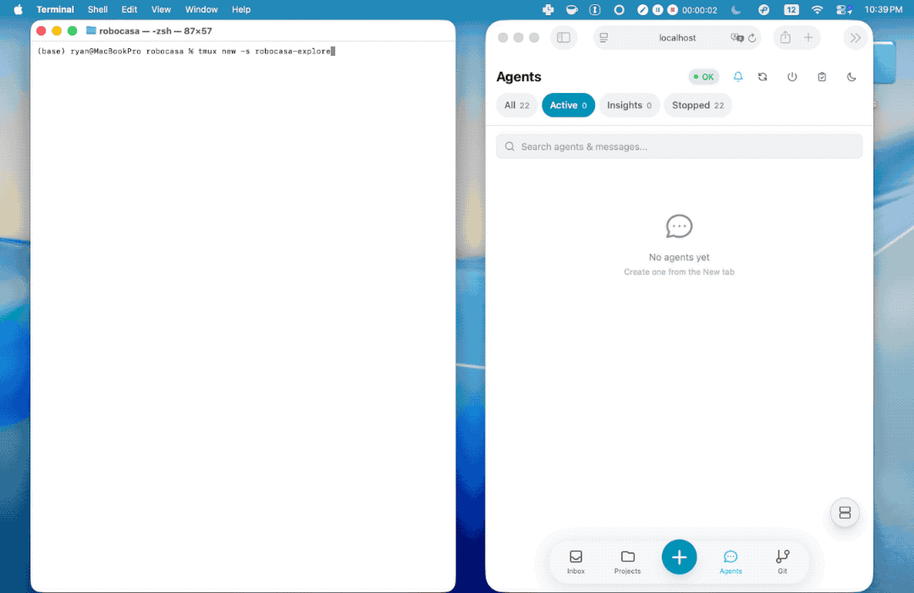

# Xylocopa

[](LICENSE)
[](https://www.python.org/downloads/)
[](https://react.dev)
[](https://fastapi.tiangolo.com)

> [**The Loop**](#the-loop) · [**Getting Started**](#getting-started) · [**Features**](#features) · [**Known Issues**](#known-issues) · [**Contributing**](CONTRIBUTING.md) · [**Host Setup**](#host-setup) · [**Client Setup**](#client-setup)
>
> **New here?** [**Getting Started**](docs/getting-started.md) · [**新手入门（中文）**](docs/getting-started-zh.md)
>
> **Going deeper?** [**A Day with Xylocopa**](docs/workflow.md) (5-minute worked example) · [**Architecture**](docs/ARCHITECTURE.md) · [**Contributing**](CONTRIBUTING.md)

**Xylocopa: capture tasks, dispatch to agents, keep the context.** 🐝

_Named after [Xylocopa caerulea](https://en.wikipedia.org/wiki/Xylocopa_caerulea): the blue carpenter bee._

Xylocopa aims to reduce the friction of navigating multiple [Claude Code](https://docs.anthropic.com/en/docs/claude-code) projects, keeping track of what you asked, what got done, and what to try next. Capture tasks into an inbox, group them by project, and dispatch to agents running in parallel on isolated worktrees. When an attempt misses the mark, retry with a summary of what was tried, so the project carries forward what was learned instead of starting over each session.

Tasks in. Agents out. Lessons kept.

If you run `claude` across several projects and want the sessions to feel like one workflow instead of a pile of terminal tabs, this is for you.

If you find Xylocopa useful, a star helps others discover it :)

## The Loop

Classic [GTD](https://gettingthingsdone.com/what-is-gtd/) has one human do all five steps (capture, clarify, organize, reflect, engage). Xylocopa keeps the loop but rewires the executor: **you capture and decide, agents execute, the system remembers.**

### 1. Capture

Get ideas into the system, fast, from anywhere.

- **Inbox**: a persistent queue across all your projects.
- **Voice input**: speech-to-text for quick ideas on the go.
- **Lightning input**: title, project, go.
- **Draft persistence**: every keystroke cached locally, survives app close or network drop.

### 2. Dispatch

Turn tasks into agents and let them run.

- **Task → Agent**: one click. Pick a model (Opus/Sonnet/Haiku), optionally enable **Auto mode** (`--dangerously-skip-permissions`; destructive commands still blocked by the [safety hook](#safety-guardrails)).
- **Parallel execution**: run many agents at once, each in its own isolated git worktree.
- **AI batch dispatch**: one click to triage and fire off a pile of inbox tasks.
- **RAG-powered context**: new agents are seeded with relevant lessons from past sessions in the same project.
- **Cross-session reference**: tell an agent "check xy session `<id>`" and it reads another agent's curated display file via a built-in [MCP server](orchestrator/mcp_server.py), ~54× fewer tokens than raw JSONL.

### 3. Monitor

Watch everything in real time, from desk or phone.

- **Mobile-first PWA**: add to Home Screen on iOS/Android.
- **Split screen**: 2/3/4 panes side by side, each navigating independently.
- **Attention button**: draggable FAB with a cyan unread badge. Tap for the oldest unread (FIFO), long-press for split screen.
- **Rich chat**: markdown, inline media, interactive cards for tool approvals and plan review.
- **Dual-directional CLI sync**: CLI sessions show up in the web app; web sessions are resumable from the CLI via `tmux attach -t xy-<id>` (legacy `ah-` still recognized).

  
- **Smart notifications**: Web Push and Telegram, suppressed when you're already viewing the agent (WebSocket or tmux). Permission requests always cut through.
- **System monitoring**: disk, memory, GPU, token usage.

### 4. Review

Check results, give feedback, grow the knowledge.

- **Mark done**: approve and close the task.
- **Try → Summarize → Retry**: stop a miss, Xylocopa auto-summarizes what was tried, the next agent picks up from there.
- **Git operations**: diffs, commit history, branch status per project. One-click cleanup and push.
- **Curated project memory**: lessons accumulate in a per-project `PROGRESS.md` that you edit and review; relevant entries are retrieved (top-k) for future agents.

### 5. Remember

Knowledge compounds across sessions, projects, and time.

- **Project memory**: per-project `PROGRESS.md`, fully UI-managed.
- **Session archive**: every conversation persisted, searchable, starrable.
- **Resume anytime**: pick up any agent where it left off.
- **Full-text search**: across tasks, messages, and sessions.
- **Weekly progress stats**: see the trend, not just the backlog.
- **Automatic backups**: DB + session history + project configs, on a configurable schedule.

## Why Xylocopa?

### Why not just use `claude`?

Vanilla `claude` is fine for one-off sessions. It frays once you run several in parallel, across multiple projects, over multiple days.

- **Attention across agents**: one **Attention button** with a badge for unread/waiting agents. Tap for the oldest, long-press for split-screen. Per-project dashboards with weekly stats, LLM-generated recaps, and an in-project search bar.
- **Capture on the go**: a PWA with voice input (Whisper), ⚡ quick-save to inbox, triage at the desk later. Every keystroke auto-drafts locally across 13+ input surfaces.
- **Find and resume old work**: full-text search across every session, with star-to-pin. One-click resume brings STOPPED/ERROR agents back (re-sync existing tmux, or relaunch via `claude --resume`).
- **Retry instead of rewrite**: Try → Summarize → Retry auto-generates what was tried; the next agent picks up with it in context. Durable lessons roll into per-project `PROGRESS.md` and are re-surfaced via RAG.
- **Rich content + cheap cross-references**: inline rendering for images, PDFs, media, and LaTeX (KaTeX). Agents reference each other's sessions via a built-in MCP server, ~54× fewer tokens than raw JSONL.

`claude` still runs the show. Xylocopa is the task, attention, and memory layer around it.

### Lessons Compound

Most agent tools assume the agent gets it right. Xylocopa assumes it won't. One click turns a miss into a summary, the next agent picks up from there, and the durable lessons accumulate per project in `PROGRESS.md`, not per session.

### Zero Migration Cost

Xylocopa wraps the same `claude` CLI you already use, launched inside tmux sessions on your machine. Your CLAUDE.md files, project setup, and workflow carry over. The only new dependencies are **tmux** and optionally **Tailscale** for remote access. No new APIs, no lock-in.

### Built for Reliability

Xylocopa hooks into Claude Code's native event system (no polling, no heuristics). Message delivery uses stop-hook dispatch with guaranteed ordering; session lifecycle is tracked via SessionStart/SessionEnd. Each agent runs in its own tmux session on a dedicated git worktree. A deterministic `PreToolUse` [safety hook](#safety-guardrails) hard-blocks destructive operations even under `--dangerously-skip-permissions`.

### Durable by Default

Nothing you run through Xylocopa is ephemeral. Every layer is designed to survive restarts, crashes, and process kills:

- **30s incremental session cache** ([`session_cache.py`](orchestrator/session_cache.py)): active JSONL is append-only-cached like git packfiles; truncated lines auto-repaired on restore.
- **Unlimited retention**: sets `cleanupPeriodDays=36500` in `~/.claude/settings.json` so Claude Code never deletes history.
- **Partial output salvage on crash** ([`agent_dispatcher.py`](orchestrator/agent_dispatcher.py)): `_recover_agents()` extracts partial stdout from `/tmp/claude-output-*.log` and persists it before re-queueing.
- **Tmux-anchored recovery**: agents with live tmux panes are re-linked without interruption on restart, your agents survive the web app.
- **One-click resume** ([`routers/agents.py`](orchestrator/routers/agents.py)): STOPPED/ERROR agents resume via re-sync or `claude --resume`.
- **Periodic backups** ([`backup.py`](orchestrator/backup.py)): DB + configs + session history, runtime-configurable interval and retention.
- **Local draft persistence** ([`useDraft.js`](frontend/src/hooks/useDraft.js)): every text input caches to `localStorage` across 13+ surfaces.
- **Orphan cleanup** ([`orphan_cleanup.py`](orchestrator/orphan_cleanup.py)): stale worktrees, zombie tmux, and tempfiles from dead processes are swept periodically.

> Every bullet is open source and linked to its implementation. Audit it, don't trust it.

## Features

### Highlights

- **Try → Summarize → Retry**: when an agent misses the mark, one click captures what was tried; the next dispatch picks up from there instead of starting cold.
- **RAG-powered context**: new agents are seeded with relevant lessons from past sessions in the same project, retrieved automatically at dispatch time.
- **Dual-directional CLI sync**: every agent runs in a tmux session you can attach to from your terminal; sessions you start in the CLI also appear in the web UI.
- **Crash-proof by design**: 30s incremental session cache, partial output salvage on restart, unlimited session retention, and one-click resume of stopped agents. Your work survives the app. See [Durable by Default](#durable-by-default).
- **Deterministic [safety hook](#safety-guardrails)**: `PreToolUse` hard-blocks destructive commands (`rm -rf`, force-pushes, `DROP TABLE`, out-of-project writes), even when agents run with `--dangerously-skip-permissions`.

### Full feature list

| Category | What you get |
|---|---|
| **Smart Notifications** | Hook-based notification system with dual-channel in-use detection, automatically notifies when you're away and stays quiet when you're present. Web Push (VAPID) and Telegram. Per-agent mute, global toggles. |
| **Task Management** | Inbox with drag-to-reorder. Voice input. Lightning capture. Draft persistence. Per-project organization. Retry with auto-summarization. |
| **Agent Control** | Start, stop, **one-click resume** of STOPPED/ERROR agents (re-sync to existing tmux or relaunch via `claude --resume`). Per-agent model selection (Opus/Sonnet/Haiku). Configurable timeouts and permission modes. AI batch dispatch. RAG-powered context from past sessions. Cross-session reference via MCP, agents read each other's curated display files (~54× fewer tokens than raw JSONL), keeping cross-references fast and context-window-friendly. |
| **Chat Interface** | Rich markdown rendering (code blocks, tables, images). Inline media preview. Plan mode with approve/reject. Interactive tool confirmation cards. |
| **Monitoring** | Split screen (up to 4 panes). Real-time WebSocket streaming. System monitor (disk, memory, GPU, tokens). Weekly progress stats. |
| **Mobile PWA** | Add to Home Screen on iOS/Android. Full functionality, voice input, push notifications, task management. |
| **CLI Session Sync** | Dual-directional: CLI sessions in the web app, web app sessions resumable from CLI. |
| **Git Integration** | Commit history, diffs, branch status per project. Agents work in isolated worktrees. One-click cleanup and push. |
| **Session History** | Every conversation persisted and searchable. Star sessions. Resume any agent anytime. Full-text search. |
| **Security** | Password auth with exponential-backoff rate limiting. Inactivity lock. HTTPS encryption. |
| <a id="safety-guardrails"></a>**Safety Guardrails** | Deterministic `PreToolUse` hook hard-blocks destructive operations, `rm -rf`, `git push --force`, `git reset --hard` outside worktrees, `git clean -f`, `git checkout -- .` / `git restore .`, `DROP TABLE` / `TRUNCATE`, and any `Write`/`Edit` to paths outside the project directory. Enforced even when **Auto mode** (`--dangerously-skip-permissions`) is on. |
| **Reliability & Recovery** | 30s incremental session JSONL cache (append-only, like git packfiles). **Unlimited retention**: `cleanupPeriodDays=36500` prevents Claude from deleting your history. Orchestrator-restart recovery re-links live tmux agents without interrupting them. Partial output salvaged from killed processes. Automatic periodic DB + config + session backups (runtime-configurable interval & retention). Truncated JSONL auto-repaired. Orphan worktree/tmux cleanup. See [Durable by Default](#durable-by-default) for source pointers. |

## Before You Install

A few things worth knowing before running this on your dev machine.

### Where does my data live?

- **SQLite DB**: `data/orchestrator.db` in the install directory (tasks, projects, agent metadata, configs)
- **Agent sessions**: `~/.claude/projects/<encoded-path>/*.jsonl` (Claude Code's native session JSONL; Xylocopa doesn't duplicate these)
- **Per-project memory**: `<project>/PROGRESS.md` inside each project's git repo
- **Backups**: `backups/` (rolling DB + session snapshots, see [Durable by Default](#durable-by-default))
- **Uploaded files**: `~/.xylocopa/uploads/`

To capture everything in one snapshot, back up the install directory and `~/.claude/projects/` together.

### How do I uninstall it?

```bash
# Stop the services
pm2 delete xylocopa-backend xylocopa-frontend && pm2 save

# Remove the install
rm -rf ~/xylocopa-main          # or wherever you cloned it
rm -rf ~/.xylocopa              # uploaded files

# Optional: remove your project directories too
rm -rf ~/xylocopa-projects

# Optional: restore Claude Code's default session-cleanup window
# (Xylocopa sets cleanupPeriodDays=36500 in ~/.claude/settings.json)
```

Project code, git history, and Claude Code session JSONL files in `~/.claude/projects/` are untouched by the uninstall.

## Getting Started

### Host Setup

#### Prerequisites

- **Linux** or **macOS** host (Ubuntu 22.04+ / macOS 13+ recommended)
- **Node.js** 18+ and npm
- **Python** 3.11+
- **tmux** (usually pre-installed; `sudo apt install tmux` if not)
- **Claude Code CLI**: `npm install -g @anthropic-ai/claude-code`, then run `claude` once interactively to log in (Xylocopa reuses the credentials in `~/.claude/`). On a headless server with no browser, use `claude setup-token` instead.
- **Claude subscription**: Claude Max or Pro (uses your existing subscription, no separate API billing)
- **OpenAI API key** _(optional, for voice input)_

#### Installation

Fastest path (clones + runs the interactive installer):

```bash
curl -fsSL https://raw.githubusercontent.com/jyao97/xylocopa/master/setup.sh | bash
```

This installs into `~/xylocopa-main` and prompts for your projects directory, default Claude model, OpenAI API key (optional), and ports. It writes `.env`, generates SSL certs, installs Python and Node dependencies, and launches the services. No manual `.env` editing required.

If you prefer to clone manually:

```bash
git clone https://github.com/jyao97/xylocopa.git ~/xylocopa-main
cd ~/xylocopa-main
./setup.sh        # same interactive prompts as above
./run.sh start
```

Verify by opening `https://<machine-ip>:3000` on the host. Find your machine's LAN IP with `hostname -I` on Linux or `ipconfig getifaddr en0` on macOS.

> **Tip:** You can also run `claude` in an empty directory and tell it to set up Xylocopa for you :)

> **Tip:** Symlink the Xylocopa repo into `~/xylocopa-projects/` to personalize your experience, let agents improve the tool while you use it.

#### Auto-Start on Reboot (PM2)

Strongly recommended, not just for reboot survival: this step also moves the pm2 daemon out of the terminal session that spawned it. On Linux that matters because systemd-oomd can SIGKILL an entire terminal cgroup (e.g. GNOME Terminal's `vte-spawn-*.scope`) under memory pressure, taking backend+frontend with it. On macOS the equivalent benefit is that pm2 no longer dies if you close Terminal.app.

```bash
./run.sh startup
```

This runs `pm2 save` + `pm2 startup` with auto-detection (systemd on Linux, launchd on macOS). On Linux it will print a `sudo env PATH=... pm2 startup systemd ...` line, copy and run it exactly as shown. On macOS no sudo is needed.

To disable later: `pm2 unstartup` (same auto-detection).

#### Set Up Your Projects

Add projects in the app: **long-press the + button → New Project**: paste any GitHub URL or point to an empty folder. You can also manually create or symlink folders in the projects directory (`~/xylocopa-projects/` by default, configured via `HOST_PROJECTS_DIR` in `.env`).

### Client Setup

After setting up the host, visit `https://<machine-ip>:3000` from any device with network access, that's it. Set a password on first visit.

#### Remote Access

For access outside your LAN, Xylocopa works with any tunneling or VPN solution, [Tailscale](https://tailscale.com), [ZeroTier](https://www.zerotier.com), [WireGuard](https://www.wireguard.com), [frp](https://github.com/fatedier/frp), Cloudflare Tunnel, etc. The author uses Tailscale:

1. Install [Tailscale](https://tailscale.com) on your server and phone
2. `tailscale up` on both devices
3. Access Xylocopa at `https://<tailscale-ip>:3000`

No port forwarding, no public exposure, traffic stays in an encrypted tunnel between your devices.

#### iPhone PWA

If you want the full app experience on iPhone (home screen icon, fullscreen, push notifications):

1. Open `https://<machine-ip>:3000` in Safari (bypass the certificate warning via **Advanced → Visit Website**, then refresh).
2. Follow the on-screen guide on the login page to install the CA certificate and the Xylocopa app.

#### Installing the CA Certificate

Xylocopa uses a self-signed SSL certificate. The host trusts it after setup, but other client devices will show a browser warning until you install the cert. iPhone/iPad users can skip this, the [iPhone PWA](#iphone-pwa) guide above already covers it.

For Android, macOS, Windows, and Linux, see [detailed instructions](docs/install-cert.md).

## Gestures & Shortcuts

- **Short-press the + button** to quickly add a task. **Long-press** it to choose between adding a project, agent, or task.
- **Double-tap an agent's session ID** to quickly copy it to the clipboard.
- **Double-tap a message** in the chat view to quickly copy its content.

## Troubleshooting

- **Conversation stuck or not updating?** Click the **refresh button** at the top of the chat view to re-sync the session from the CLI.
- **Agent shows IDLE after server restart but is still running?** Normal. Status restores to EXECUTING on the next tool call (heartbeat via the `agent-tool-activity` hook). Send a message to trigger activity if it's in a long thinking phase.
- **Don't name tmux sessions with the `xy-` or `ah-` prefix** — those are Xylocopa's managed prefixes (`xy-{id}`; legacy `ah-{id}` still recognized). User-created sessions with those prefixes won't be detected.
- **PWA stuck on a perpetual loading screen?** Stale Service Worker precache. Run `.venv/bin/python tools/push_reset.py` on the host for an interactive picker (lists devices with labels and last-ack times; `a` resets all, `q` quits). Then fully close the PWA on the device and reopen it. Direct forms `list`/`<sub_id>`/`all` are supported for scripting.

## Known Issues

- **iPad & mobile browser layout**: layout needs further optimization for iPad and non-PWA mobile browsers. There are minor visual quirks on iPad standalone mode. Tested and working correctly on iPhone (Add to Home Screen) and desktop browsers.
- **CLI sessions started while backend is offline are silently missed**: adoption of externally-created `claude` CLI sessions relies on the `SessionStart` hook reaching the backend over HTTP. If the backend happens to be down at that moment (e.g. a crash, oomd kill, or manual restart window), the hook's offline fallback only persists managed-agent signal files, unmanaged session markers are dropped, and there is no startup rescan. The session will run normally but never appear in the "unlinked sessions" adoption UI. Workaround: after the backend is back, exit and re-launch `claude` in the same tmux pane so the hook fires again. Tracked in `TODO.md`.

## Contributing

We welcome contributions! See [CONTRIBUTING.md](CONTRIBUTING.md) for guidelines on:

- Reporting bugs and suggesting features
- Setting up a development environment
- Running tests and submitting pull requests

## Migration from AgentHive

Xylocopa was previously named **AgentHive**. The upgrade is backward compatible, no manual migration needed:

- **CLI**: `agenthive` stays as a symlink to `xylocopa`.
- **Install dir / env vars**: `AGENTHIVE_DIR` and `AGENTHIVE_MANAGED` still honored alongside the new `XYLOCOPA_*` names. `~/agenthive-main` checkouts keep working.
- **Process names**: `pm2` processes are now `xylocopa-backend` / `xylocopa-frontend` (upgrade script removes the legacy `agenthive-*` entries).
- **MCP / tmux**: `.mcp.json` entry renamed to `xylocopa` on first agent start; new agents use `xy-{id}` prefix, legacy `ah-{id}` sessions are still recognized so in-flight agents survive.
- **Data dirs**: `~/.agenthive/uploads` auto-renames to `~/.xylocopa/uploads` on first backend start (if the new path doesn't exist).
- **Browser / certs / Web Clip**: `localStorage` keys auto-migrate on first page load; existing certs keep working; re-download `Xylocopa.mobileconfig` from the login page if you want the renamed Home Screen entry.

To rename your install dir: `mv ~/agenthive-main ~/xylocopa-main && cd ~/xylocopa-main && ./run.sh restart`.

## License

Apache 2.0, see [LICENSE](LICENSE) for details.
