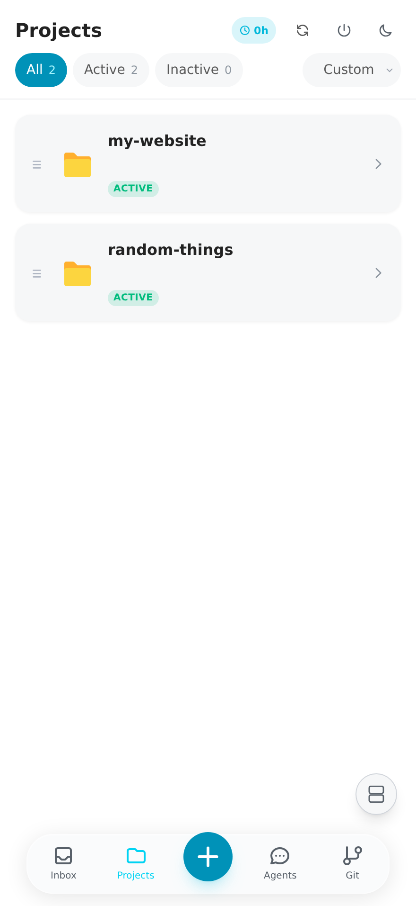
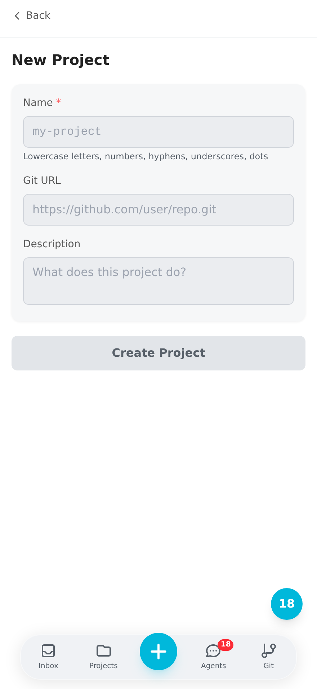
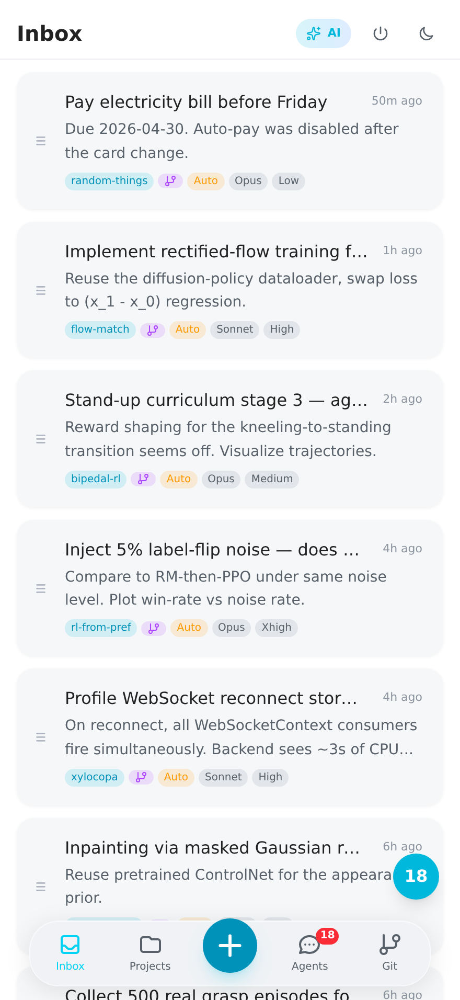
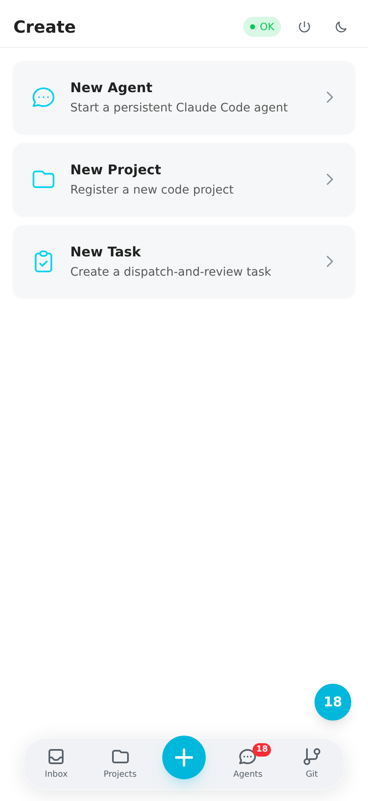
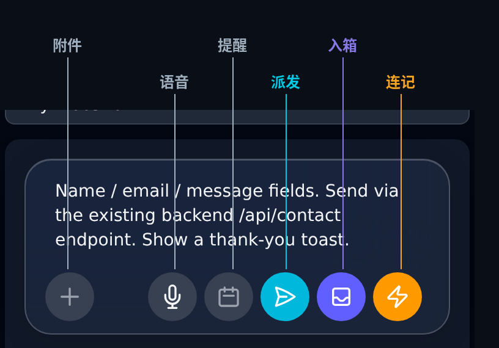
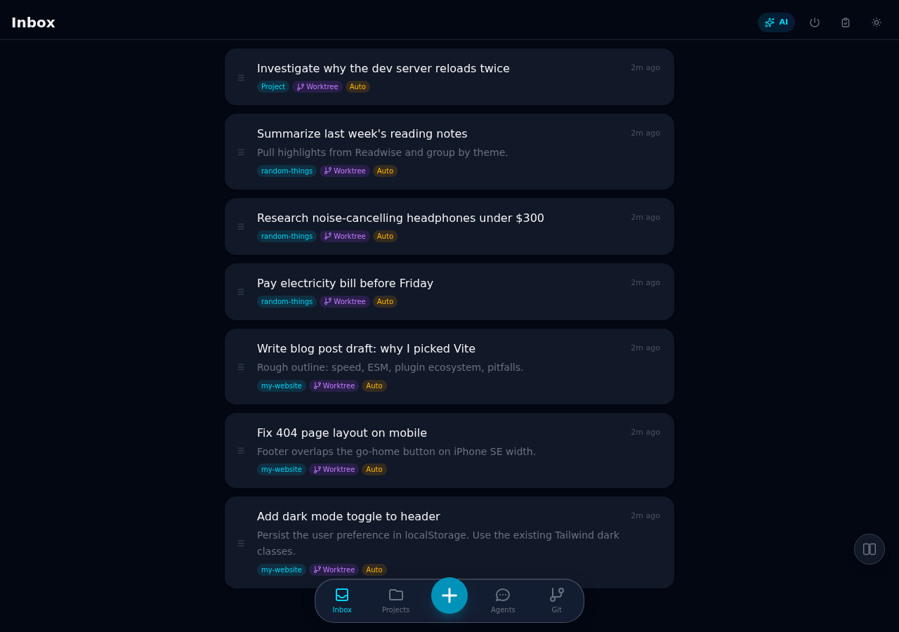

# Xylocopa 新手入门

> 一份面向新用户的实操教程 —— 读完后，你能独立完成"建项目 → 提任务 → 看 agent 执行"的完整闭环。
>
> English: [getting-started.md](getting-started.md)

这份文档针对刚装完 Xylocopa（[安装步骤](../README.md#host-setup)）但不知道接下来该怎么用的新人。它**不**重复 README 里的功能列表，而是回答每个新用户都会卡住的三个问题：

1. **任务输入框底下那排按钮都是啥？**
2. **Inbox / Project / Task / Agent / Session 这几个词都什么意思，互相怎么配合？**
3. **至少要掌握哪些最少的操作才能跑起来？**

---

## 整体流程一览

Xylocopa 是 AI 原生的 [GTD](https://zh.wikipedia.org/wiki/%E6%90%9E%E5%AE%9A%E5%85%B6%E4%BA%8B)。GTD 的思路很简单：把想法从脑子里倒出来，之后再决定怎么处理，时机到了再动手。Xylocopa 保留这个循环 —— 但"动手"那一环交给 AI agent，不是你自己。

```
          ┌─────────────────────────────────────────────────────────┐
          │                                                         │
  灵感    │    Inbox  ──▶  Project  ──▶  Task  ──▶  Agent  ──▶  Session
 ──────▶  │    (捕捉)      (归属)        (规划)     (执行)         (复盘&记忆)
          │                                                         │
          └─────────────────────────────────────────────────────────┘
                                                                    │
                                                   经验沉淀 ─────────┘
                                                   写回 PROGRESS.md
```

- 灵感来了，你先把它**捕捉**进 **Inbox** —— 无摩擦、不用想。
- 之后（或立刻），把任务归到一个 **Project** 下并**派发**，这会启动一个 **Agent**（一个 Claude Code 会话）去执行它。
- Agent 跑完 —— 或者卡住 —— 你**复盘** **Session**，确认完成或继续迭代。可复用的经验写进 `PROGRESS.md`。

整个循环就这么回事，下面把每个概念展开。

---

## 核心概念

### Project（项目）
一个 **project** 是一组相关工作的容器，通常对应磁盘上一个 git 仓库 —— 可以是你本来就有的仓库，也可以让 Xylocopa 从 GitHub URL 克隆。project 下派发的 agent 在这个项目的目录里跑。

<p align="center"></p>

**不想折腾多个 project 怎么办？** 完全可以。建一个大杂烩 project —— 作者本人就有一个叫 `random-things` 的项目，什么零碎事都往里扔（交水电费、买耳机做调研、整理读书笔记、写个一次性的小脚本）。所有任务都住在一个 project 下，你不用再想归类的事。以后想拆分也随时能拆。

<p align="center"></p>

建项目的方式：**长按底部导航栏的 `+` 按钮 → New Project**。只有 **Name** 是必填的。填了 **Git URL** 就会自动克隆；不填就在 `~/xylocopa-projects/<name>/` 下建一个空目录。

### Task（任务）
一个 **task** 是一件你想做的具体事 —— "加一个联系表单"、"修移动端底栏"、"交电费"。task 有标题、可选描述、可选的所属 project，以及一些参数（模型、思考深度、worktree、Auto 模式）。

新建的 task 默认进 **inbox**，派发时才离开 inbox。

### Inbox（收件箱）
Inbox 是**跨所有 project 共享的一个队列**。任务先进来，再处理。尽量保持 inbox 短。

<p align="center"></p>

为什么所有 project 共用一个 inbox？因为脑子里蹦出想法的时候，你不想停下来问自己"这个该归哪个项目"。你只想把它记下来然后接着干别的。Inbox 就是让你这么做。归类之后再说。

### Agent
**Agent** 是 Xylocopa 管理的一个活着的 Claude Code 会话。派发任务时，一个 agent 会在 project 目录（或一个隔离的 [git worktree](https://git-scm.com/docs/git-worktree) —— 见 Worktree 开关）里启动，跑完等你复盘。

每个 agent 住在一个叫 `xy-<短 id>` 的 tmux 会话里，你可以从任何终端 attach 上去继续聊。参考 README 里的 [Dual-directional CLI sync](../README.md#3-monitor)。

### Session
你和 agent 的每一次对话都会持久化成一个 **session**（既包括 Claude 自己写的 JSONL，也包括 Xylocopa 按消息粒度缓存的快照）。session 默认永不过期，除非你手动删。你可以随时恢复任何一个 session —— 昨天的、上个月的 —— agent 会带着完整上下文继续聊。

---

## 最少 5 分钟上手

### 1. 建一个 project

长按底部导航栏的 `+` 按钮，**Create** 菜单弹出来，三个选项：

<p align="center"></p>

选 **New Project**，起个名字（小写字母 / 数字 / `- _ .`），可选地粘贴 Git URL，点 **Create Project**。

> **懒人版**：如果只想要一个倒垃圾的地方，起名叫 `random-things` 或 `misc`，完事。后面想拆分再拆。

### 2. 提一条任务

回到 Inbox 页，**短按** `+` 按钮（长按会再次打开 Create 菜单）。**New Task** 面板从底部滑上来。

<p align="center"></p>

- **Title** 是可选的 —— 不填 Xylocopa 会从描述里自动生成一个。
- **Project** —— 从下拉里选一个，或者留空表示"未归类"（之后再归）。
- **Describe what needs to be done** —— 自由文本，这就是发给 agent 的 prompt。
- **Model** —— Opus / Sonnet / Haiku。默认 Opus；简单任务选便宜的。
- **Effort** —— L / M / xH / Max。越高思考越多，越慢越贵。
- **Worktree** 开关 —— 打开后 agent 在一个隔离的 git worktree 里干活，不会和你（或其他 agent）同时开着的分支打架。
- **Auto** 开关 —— 见下面 [Auto 模式与安全](#auto-模式与安全)。

### 3. 现在派发？还是先塞进 inbox？

输入框底下那排六个按钮（从左到右）：

<p align="center"></p>

| 图标 | 名称 | 作用 |
|---|---|---|
| `+` | 附件 | 贴图片、PDF、文本文件 —— 作为上下文传给 agent。 |
| 🎙️ | 语音输入 | 说话录入。用 OpenAI Whisper 转文字（需要 `OPENAI_API_KEY`）。手机上尤其好用。 |
| 📅 | 定时提醒 | 给这条任务设一个推送通知 —— 比如周五早上 9 点提醒我。任务本身仍在 inbox。 |
| ✈️ | **立刻派发** | 建任务**并**立刻派发 —— 直接跳到 agent 的对话页。_只有选了 project 才显示这个按钮。_ |
| 📥 | **存进 inbox 并关闭** | 存进 inbox，面板收起。默认的"这事我晚点再管"。 |
| ⚡ | **存进 inbox 并立即开下一条** | 存进 inbox，**面板不关**，光标留在输入区，紧接着能写下一条。一口气记五个想法时用这个。 |

右边三个彩色按钮就是离开这个面板的三种方式。按意图选：

- 路上随手记想法 → **⚡ 闪电**（连着记下一条）或 **📥 收件箱**（记一条就走）。
- 想让 agent **立刻开干** → **✈️ 纸飞机**。

### 4. 看 agent 跑

派发后你会进入 agent 的对话页，可以：

- 实时看 agent 的思考和工具调用流式输出。
- 审批或拒绝工具调用（Auto 模式关着的时候）。
- 发后续消息、纠偏、停掉 agent。
- **双击一条消息**复制它的内容。**双击 session ID** 复制 session ID。

桌面端右下角有分屏按钮，可以同时盯 2–4 个 agent：

<p align="center"></p>

---

## 处理 inbox

记得比派得快，inbox 就会堆积。三种消化方式：

1. **点进某条任务** → 编辑、选 project、在详情页点 **Dispatch**。
2. **拖动左边的 `≡` 手柄** 重排顺序 —— 最上面的代表"最先做"。
3. **AI 批处理**（inbox 右上角那个 `AI` 按钮）—— 一键让一个 triage agent 把所有任务读一遍，润色 prompt 并分配 project。分配结果你先 review，确认后再批量派发。适合"这一周我记了十几条，现在一次处理"。

项目级的任务列表和统计见 [project 详情页](getting-started/07-project-detail.png)。

---

## Auto 模式与安全

打开 **Auto**（橙色开关）后，Xylocopa 会用 `claude --dangerously-skip-permissions` 启动 agent。意思是 agent 执行每个工具调用**不会暂停问你**，直接跑。

听起来有点吓人，但其实不怕 —— 因为 Xylocopa 挂了一个[确定性的 safety hook](../README.md#safety-guardrails)，**不管** Auto 开不开，都会硬拦以下危险操作：

- `rm -rf` / `rm -rf /`
- 非 worktree 目录下的 `git push --force` / `git reset --hard`
- `git clean -f`、`git checkout -- .`、`git restore .`
- `DROP TABLE`、`TRUNCATE`
- 所有写到 project 目录之外的 `Write` / `Edit`

低风险任务（写文档、改 UI 细节、worktree 里的隔离重构）打开 Auto。想让每个工具调用都经过你手，就关着。

---

## Agent 跑偏了怎么办

Xylocopa 假设 agent 总有跑偏的时候。标准恢复流程是 **Try → Summarize → Retry**：

1. 停掉 agent。
2. 在任务详情页点 **Summarize** —— Xylocopa 读完整个 session，写一份"试过什么、什么没 work、下一步建议"的简报。
3. 编辑这份简报、加上你的指点，点 **Redo**。新的 agent 带着这份简报开始跑，不会重复犯同样的错。

能复用的经验（不是 session 特定的细节）会沉淀到项目的 `PROGRESS.md`，之后派发新 agent 时会被 RAG 自动拉回来。项目会随着你用越变越聪明，而不是每次从零。

---

## 常见场景

**"地铁上突然想到一件事。"**
打开 PWA，点 `+`，对着麦克风说一句，点 ⚡（闪电）。5 秒搞定，回头再处理。

**"手头攒了十几条任务，想一次处理完。"**
打开 inbox，点右上角的 **AI** 按钮。Triage agent 会帮你润色并分配 project。review 一下，批量派发。

**"我不喜欢整理，就想有一个地方装所有东西。"**
建一个叫 `random-things`（或 `misc`、或你的名字）的 project，所有任务都扔里面。代价是丧失 per-project RAG，其他所有功能照旧能用。

**"Agent 开始原地打转了。"**
立刻停。Summarize 一下 session，加一句一句话的纠正，Redo。不要让一条错路一直烧到 token 上限。

**"想同时盯三个 agent。"**
桌面端：页面右下角有分屏按钮，选 2/3/4 分屏，每个窗格各自导航。移动端：用 **Attention 按钮**（可拖动的 FAB）—— 任何 agent 有新消息时它变成青色，点一下就跳到最早那条没读的对话。

---

## 接下来看什么

- [README — The Loop](../README.md#the-loop) —— 完整的功能导览
- [README — Durable by Default](../README.md#durable-by-default) —— 崩溃/重启/退出后数据如何留存
- [ARCHITECTURE.md](ARCHITECTURE.md) —— 系统架构
- [install-cert.md](install-cert.md) —— 在客户端设备上信任自签名 HTTPS 证书
