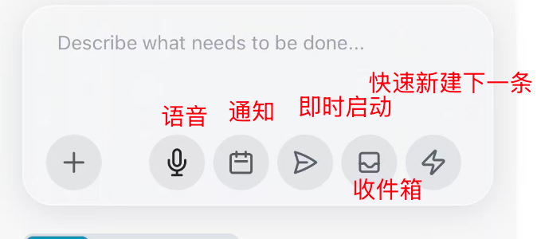

# Getting Started with Xylocopa

> A beginner's walkthrough — by the end, you'll have created a project, captured your first task, and watched an agent execute it.
>
> 中文版：[getting-started-zh.md](getting-started-zh.md)

This guide is for people who just installed Xylocopa (see the [host setup](../README.md#host-setup) in README if you haven't) and want to understand what to actually do with it. It does **not** repeat the feature list — for that, read the README. It answers the three questions every new user hits:

1. **What are all those buttons in the task-input panel?**
2. **What's the difference between Inbox, Project, Task, Agent, and Session — and how do they fit together?**
3. **What's the minimum workflow I need to know to be productive?**

---

## The Loop at a glance

Xylocopa is an AI-native take on [GTD](https://gettingthingsdone.com/). The idea of GTD is simple: get ideas out of your head, decide what to do with them later, and act on them when the time is right. Xylocopa keeps that loop — but the "actor" is an AI agent, not you.

```
         ┌─────────────────────────────────────────────────────────┐
         │                                                         │
   idea  │    Inbox  ──▶  Project  ──▶  Task  ──▶  Agent  ──▶  Session
  ──────▶│    (capture)   (bucket)      (plan)     (execute)   (review & remember)
         │                                                         │
         └─────────────────────────────────────────────────────────┘
                                                                   │
                                                         lessons ──┘
                                                         roll back into PROGRESS.md
```

- You **capture** an idea into the **Inbox** — fast, no friction, no thinking.
- Later (or immediately), you assign the task to a **Project**, then **dispatch** it. That spawns an **Agent** (a Claude Code session) which works on it.
- When the agent's done — or gets stuck — you **review** the **Session**, mark it done, or iterate. Durable lessons get saved into `PROGRESS.md`.

That's the whole loop. The rest of this doc just fills in the details.

---

## Core concepts

### Project
A **project** is a bucket for related work. Usually it's backed by a git repo on disk — either a repo you already have, or one Xylocopa clones from a GitHub URL. Agents dispatched under a project run inside that project's working tree.

<p align="center"></p>

**Don't want to bother with multiple projects?** Totally fine. Create one catch-all project — the author personally uses a `random-things` project for anything that doesn't deserve its own repo (bills, shopping research, reading notes, a one-off script). All tasks live inside it, and you're done. You can always split things out later.

<p align="center"></p>

To create one, long-press the `+` button in the bottom nav → **New Project**. Only the **Name** is required. If you supply a **Git URL**, Xylocopa clones it; if you leave it blank, you get an empty folder under `~/xylocopa-projects/<name>/`.

### Task
A **task** is a single unit of work you want done — "add a contact form", "fix the mobile footer", "pay the electricity bill". A task has a title, an optional description, optionally a project, and some knobs (model, thinking effort, worktree, Auto mode).

Tasks start their life in the **inbox** and leave it when you dispatch them.

### Inbox
The inbox is the **one shared queue across every project**. You capture into it, and process from it. Keep it short.

<p align="center"></p>

Why a single inbox across all projects? Because most of the time, when an idea hits you, you don't want to stop and ask "which project does this belong to?" You want to dump it and move on. The inbox lets you do that. Sorting comes later.

### Agent
An **agent** is a running Claude Code session that Xylocopa manages. When you dispatch a task, an agent is spawned inside the project's directory (or an isolated [git worktree](https://git-scm.com/docs/git-worktree) — see the Worktree toggle), runs the task, and waits for you to review.

Each agent lives in its own tmux session named `xy-<short-id>` — you can attach from any terminal and keep working. See [Dual-directional CLI sync](../README.md#3-monitor) in the README.

### Session
Every conversation with an agent is persisted as a **session** (both the JSONL Claude writes on disk, and Xylocopa's own per-message cache). Sessions never expire unless you delete them. You can resume any session — yesterday's, last month's — and the agent picks up with its full context.

---

## Your first five minutes

### 1. Create a project

Tap and hold the `+` button in the bottom nav. The **Create** menu opens with three options:

<p align="center"></p>

Pick **New Project**, give it a name (lowercase letters, numbers, hyphens, underscores, dots), optionally paste a Git URL, and hit **Create Project**.

> **Shortcut**: if you just want a dumping ground, name it `random-things` or `misc` and be done. You can always add more projects later.

### 2. Capture a task

Back on the Inbox tab, tap the `+` button (short press this time — long-press re-opens the Create menu). The **New Task** sheet slides up.

<p align="center"></p>

- **Title** is optional — if blank, Xylocopa derives one from your description.
- **Project** — pick one from the dropdown, or leave blank to save to inbox as "unassigned" (triage later).
- **Describe what needs to be done** — free-form prompt. This is what the agent sees.
- **Model** — Opus / Sonnet / Haiku. Opus is the default; pick cheaper for simple tasks.
- **Effort** — L / M / xH / Max. Higher = more thinking, slower, more expensive.
- **Worktree** toggle — if on, the agent works in an isolated git worktree so it won't step on anything else you (or other agents) have open.
- **Auto** toggle — see [Auto mode + safety](#auto-mode--safety) below.

### 3. Decide: dispatch now, or park in the inbox?

The six buttons on the input bar (left → right):

<p align="center"></p>

| Icon | Name | What it does |
|---|---|---|
| `+` | Attach files | Attach images, PDFs, text files — passed to the agent as context. |
| 🎙️ | Voice input | Dictate. Transcribed with OpenAI Whisper (needs `OPENAI_API_KEY`). Great on phone. |
| 📅 | Set reminder | Schedule a push notification for this task — e.g. remind me Friday at 9am. The task stays in the inbox. |
| ✈️ | **Launch agent** | Create the task **and** immediately dispatch it — you land in the agent's chat. _Only appears when a project is selected._ |
| 📥 | **Save to inbox & close** | Park it in the inbox, close the sheet. Default for "I'll deal with this later." |
| ⚡ | **Quick save to inbox** | Park it in the inbox, **keep the sheet open** so you can type the next idea immediately. Use this when you have five thoughts to dump in a row. |

The three colored buttons on the right are the three ways to leave this sheet. Pick by intent:

- You're capturing an idea on the go → **⚡ Quick save** (stay here for the next one) or **📥 Save** (one and done).
- You want the agent to start **right now** → **✈️ Launch agent**.

### 4. Watch it run

If you dispatched, you're now in the agent's chat view. You can:

- Read the agent's thinking and tool calls as they stream in.
- Approve or deny tool calls (when Auto mode is off).
- Send follow-ups, course-correct, or stop the agent.
- **Double-tap a message** to copy it. **Double-tap the session ID** to copy the session ID.

On desktop, tap the split-screen button (bottom-right corner) to watch 2–4 agents at once:

<p align="center"></p>

---

## Processing the inbox

When you've captured faster than you've dispatched, the inbox piles up. There are three ways to drain it:

1. **Tap a task** → edit it, pick a project, hit **Dispatch** on the detail page.
2. **Drag the handle** (`≡` on the left of each card) to reorder — the top of the list is "do first".
3. **AI batch process** (the `AI` button in the top-right of the inbox) — one tap, and an AI triage agent reads every task, refines the prompt, and assigns a project. You review the result before it actually dispatches. Great for "I captured 15 things this week, now deal with them."

See the [project detail view](getting-started/07-project-detail.png) for per-project task lists and stats.

---

## Auto mode + safety

When you toggle **Auto** (the orange switch), Xylocopa launches the agent with `claude --dangerously-skip-permissions`. That means the agent **won't stop to ask permission** for each tool call — it just runs.

That sounds scary. It isn't, because Xylocopa installs a [deterministic safety hook](../README.md#safety-guardrails) that hard-blocks destructive commands **regardless** of Auto mode:

- `rm -rf` / `rm -rf /`
- `git push --force` / `git reset --hard` outside worktrees
- `git clean -f`, `git checkout -- .`, `git restore .`
- `DROP TABLE`, `TRUNCATE`
- `Write` / `Edit` to paths outside the project directory

Turn Auto on for low-risk tasks (documentation, UI tweaks, isolated refactors in a worktree). Keep it off if you want a human-in-the-loop for every tool call.

---

## When the agent misses the mark

Xylocopa assumes the agent will sometimes get it wrong. The recovery path is **Try → Summarize → Retry**:

1. Stop the agent.
2. In the task detail, tap **Summarize** — Xylocopa reads the full session and writes a concise "what was tried, what didn't work, what to try next."
3. Edit that summary, add your feedback, and tap **Redo**. A fresh agent picks up with the summary in context, so it doesn't repeat the same mistakes.

Durable lessons (not session-specific) get saved to `PROGRESS.md` in the project — which is automatically retrieved by future agents via RAG. Your project gets smarter over time instead of resetting.

---

## Common scenarios

**"I just had an idea on the subway."**
Open the PWA, tap `+`, speak it into the mic, hit ⚡ (Quick save). Done in five seconds. Triage later.

**"I have 10 things stacked up and I want to deal with them in one go."**
Open the inbox, tap the **AI** button top-right. The triage agent refines and assigns each one. Review, then bulk dispatch.

**"I don't like organizing, I just want one place to put everything."**
Create a single project called `random-things` (or `misc`, or your first name). Put every task there. You lose per-project RAG, but you keep everything else.

**"Agent started going in circles."**
Stop it. Summarize the session. Add a one-line correction. Retry. Don't let a bad trajectory run to the token limit.

**"I want to monitor three agents at once."**
On desktop: tap the split-screen button (bottom-right of any page), pick 2/3/4 panes. Each pane navigates independently. On mobile: use the **Attention button** (draggable FAB) — it turns cyan when any agent has new messages, tap to jump to the oldest unread.

---

## Where to go next

- [README — The Loop](../README.md#the-loop) — the full feature tour
- [README — Durable by Default](../README.md#durable-by-default) — how your work survives crashes
- [ARCHITECTURE.md](ARCHITECTURE.md) — system design
- [install-cert.md](install-cert.md) — trust the self-signed HTTPS cert on your client devices
