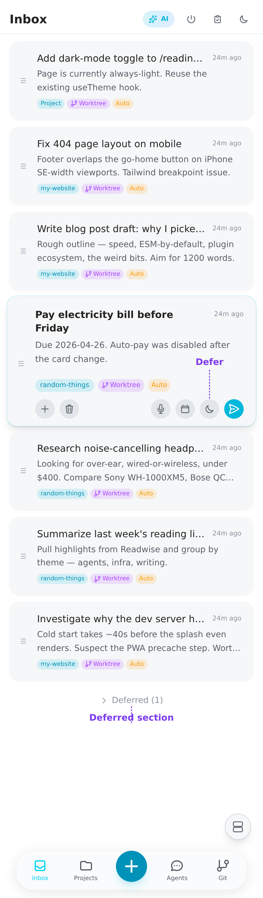

# A Day with Xylocopa

Five things popped into my head between coffee and standup. Here's what I did with them.

## 1. Dump everything into the inbox

Hit **+** for each one, type, hit **Save**. No project, no priorities, no thinking about who's going to do them. Two seconds each:

- a contact form for the home page
- the 404 page bug on mobile
- the blog post draft about Bun
- the domain renewal coming up next Friday
- the electricity bill

## 2. Defer the one I can't act on yet

The domain renewal isn't due until next Friday. Tap to expand the card, tap the moon icon, pick a date. It disappears into a **Deferred** section at the bottom, hidden until its date arrives.

## 3. Dispatch the most concrete one

The contact form is well-specified, start there. Tap into the task, set model and effort, tap **Launch**. An agent spawns in a fresh git worktree, runs the work, streams its output to the chat view.

## 4. Walk away

The agent is on its own. Push notifications fire when it finishes or asks for input. Want to monitor several at once? Open split-screen on desktop.

## 5. Retry when it misses the mark

Form looks right, but the email validation only runs client-side. Stop the agent, hit **Summarize**, add "validate server-side too" to the summary, hit **Retry**. The next agent picks up with the summary in context, it doesn't need to re-discover what was tried.

## 6. The day ends; the system holds up its end

Two tasks done, one in progress, one deferred until next Friday, one still in the inbox. The agents that did the work are gone. But:

- Each completed task left a session you can resume.
- The project (`my-website`) carries forward what was learned: the next form-validation task starts with the lesson from today.
- The deferred renewal will surface on its date.

Tomorrow you do five more. Repeat.

## See also

- [Getting Started](getting-started.md): full beginner walkthrough with all the buttons explained.
- [README · The Loop](../README.md#the-loop): the five-step Capture → Dispatch → Monitor → Review → Remember framework.
